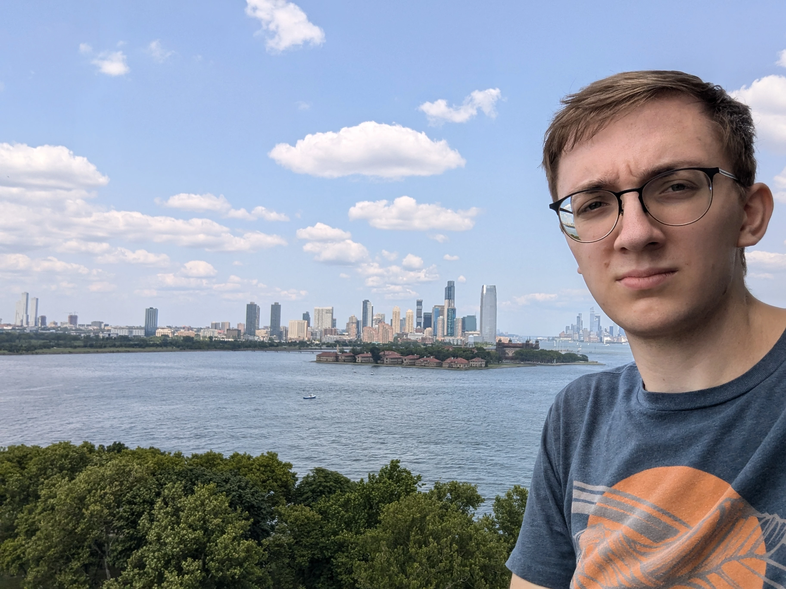

I am a Physics PhD candidate at Duke University working with Prof. Ayana Arce on fun things with single top quark decays. To that end, I am currently an active author with the ATLAS collaboration at the LHC (Large Hadron Collider). My work is focused on measuring the spin entanglement between the decay products of decaying top quarks, a task I'm using machine learning frameworks developed within the high energy physics landscape to accomplish. As part of my ATLAS authorship qualification task, I spent a year at Brookhaven National Lab performing and developing quality assurance procedures for the production of the ATLAS detector's silicon strip detector upgrade. It's a busy time in the field of particle physics, and I'm happy to be involved!

I did my undergraduate at Berry College, a small liberal arts school in Rome, GA. I graduated with a double major in Physics and Mathematics. While at Berry I worked with Dr. Zachary Lindsey on a variety of projects involving Magnetron Sputtering and benchtop growth of InGaXX crystals.

Outside of academia, I've "written" books on the [essentials of debugging](/other/books), designed cases for some [small keyboards](/other/keyboards), and some [other etceteras](/other/standardmodel).
