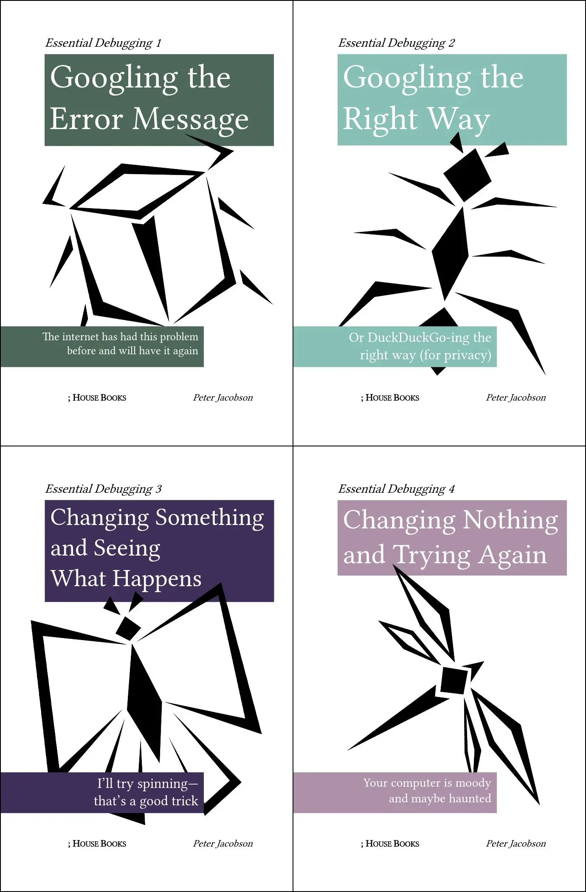
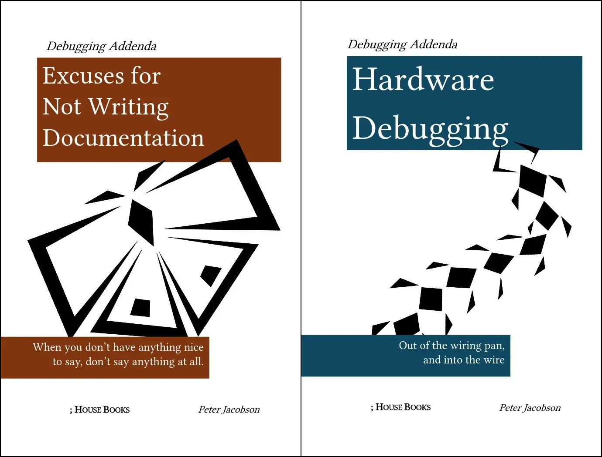
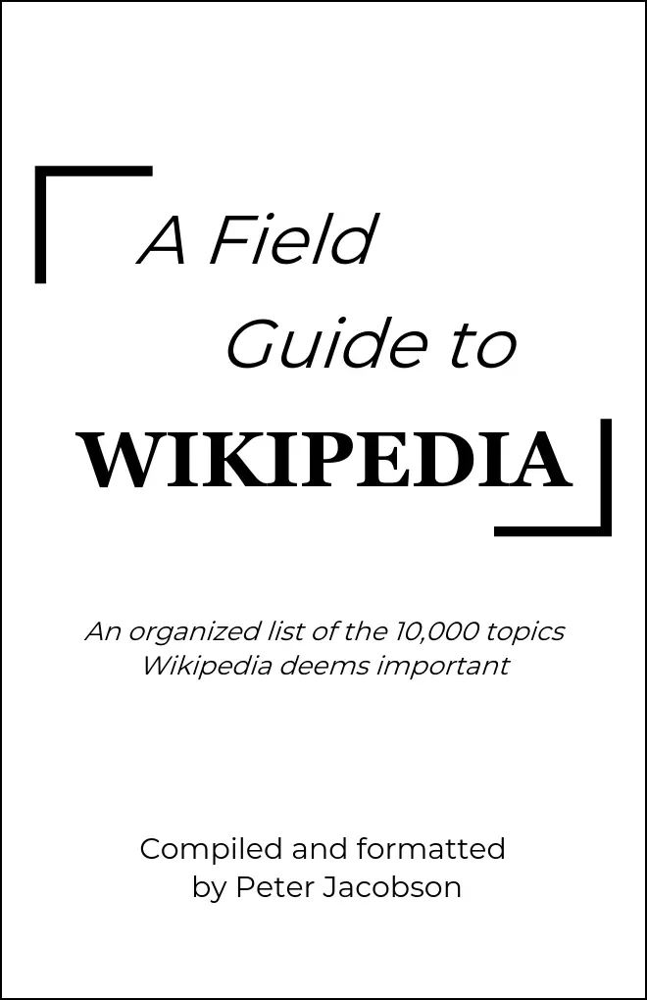



## Debugging Essentials

     
Inspired by The Practical Developer's *Googling the Error Message* book cover generated with [O'RLY Covers](https://orlybooks.com/), I thoght it would be funny to have something like that in the physical world. Taking further inspiration from O'RLY, I settled on a 4 book "Essential Debugging" set consisting of *Googling the Error Message*, *Googling the Right Way*, *Changing Something and Seeing What Happens*, and *Changing Nothing and Trying Again*. These 4 topics were determined from my own experience debugging code. The books feature relevant, tongue-in-cheek blurbs, accolades, and chapter titles, but the "content" of the book is entirely composed of [Lorem Ipsum](https://www.lipsum.com/). A small run of the series was printed and distributed amongst various other grad students and staff.  
The artwork on the covers and rest of the design is by myself. *No generative A.I. was used in this project*.  
*Summer 2024*

### Debugging Addenda

     
My time at Brookhaven National Lab involved testing of electronics and following documentation of varying levels of quality. This inspired two additions to the debugging series, *Excuses for Not Writing Documentation* and *Hardware Debugging*. While the latter is similar in form to "Essential Debugging", *Excuses* is a larger text filled entirely with blank pages.  
The artwork on the covers and rest of the design is by myself. *No generative A.I. was used in this project*.  
*Fall 2024*

## A Field Guide to Wikipedia

     
In 2022, my sister's then-boyfriend, now-husband and I bonded over a wordle-style game called Redactle. The original game has gone offline, but the basic gist of it and its many clones is trying to guess a Wikipedia article that has had most of the words censored. To give the players some chance at success, the game picks from a pool of Wikipedia's "vital articles" (in this case level 4), a collection of 10,000 of Wikipedia's "most important" articles. This book is an organized collection of those article titles, presenting a field guide to what topics Wikipedia calls important. A small quantity was printed to achieve economies of scale, but I'm not certain where they all ended up.  
*Fall 2022*
