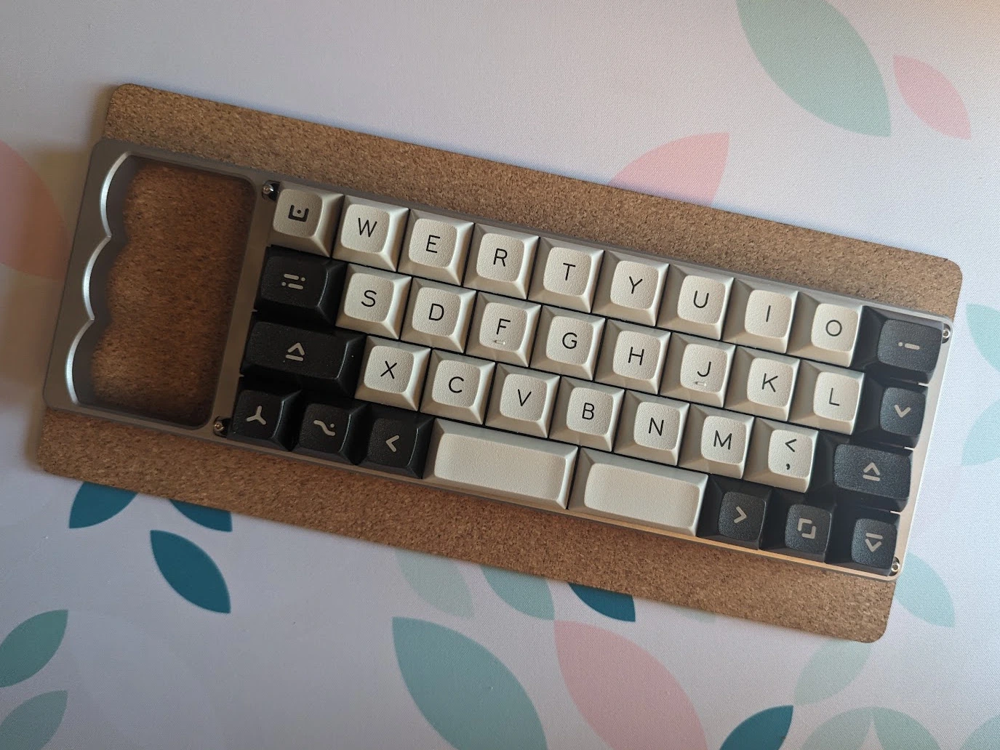
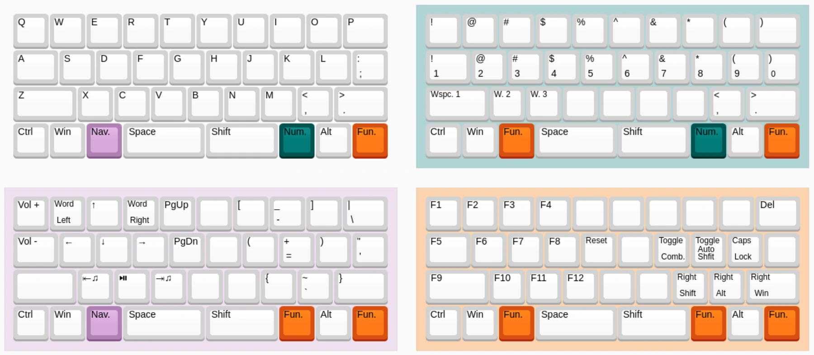

I like using small keyboards at my computer. These are typically called "40%" keyboards, referring to their size relative to the norm. They seem to be missing some important keys, but can do everything I need to type, design, and program. The basic principle is more actions less distance: everything I need is right under my fingertips, but I might need to use multiple fingers to do it. In the same way you type "@" by pressing `shift + 2`, I type "2" by pressing `Num. Layer + S` and "@" by pressing `Num. Layer + W`. I've put more of the "how" and what my keymap looks like at the [bottom of the page](about:blank)

As part of this fun, I've designed cases for pre-existing PCBs (I haven't designed a PCB of my own *yet*). 

## Knuqull

     
This is a handled low-pro case for the [QAZ PCB](https://www.cbkbd.com/product/qaz) based on the existing [Qull](https://www.cbkbd.com/product/qull) case for the QAZ and [KnuckHull](https://trashman.wiki/community/cases/knuckhull) case for the minivan keyboard. I thought handles were fun, and wanted something small but hefty I could lug around.  
I have a personal unit milled out of stainless steel, and a small run of aluminum knuqulls was produced and sold by [Coffee Break Keyboards](https://www.cbkbd.com/)  
This design is open-sourced on [my github](https://github.com/prjacobson/Knuqull)

## Other designs 

I won't include a section for each of my designs, but I've also designed cases for [minivan PCBs](https://github.com/prjacobson/Bateau), [infernum PCBs](https://github.com/prjacobson/Punishment), and [Bruce the Keyboard](https://github.com/prjacobson/Not-The-Human). All of these designs are also open-sourced, and have been printed/manufactured by myself and others in the community.

## How do you use this?

We can look at Knuqull as an example. Custom keyboards can be programmed using [QMK firmware](https://qmk.fm/), its fork [Vial](https://get.vial.today/), or other firmwares such as [ZMK](https://zmk.dev/) or [FAK](https://github.com/semickolon/fak). The image below shows how I have my Knuqull programmed:

The keys next to the two bars are my main keys for switching layers. By pressing the `Nav.` key with my left thumb, I have access to navigation keys under my left hand, and symnol keys under my right hand. By pressing the `Num.` key with my right thumb, I have access to the entire number row and their symbols without moving far from the home row.  
I'm also a big user of combos or chords, functions access by pressing multiple keys at once. For example, my `J+K` combo lets me delete things without moving any fingers off the homerow.

This is far from the only way to do things, but it's the way I've settled on after a few years of using boards like this. There are other layouts of keys (I'm particularly fond of katana stagger and columnar stagger), other layouts of letters besides QWERTY (sometimes I use the [Workman layout](https://workmanlayout.org/)), and even smaller boards that I'm not comfortable using. If you're interested, search 40% keyboards on github for some designs, join the 40% keyboard discord, or reach out to me, I'm happy to ramble even further.
