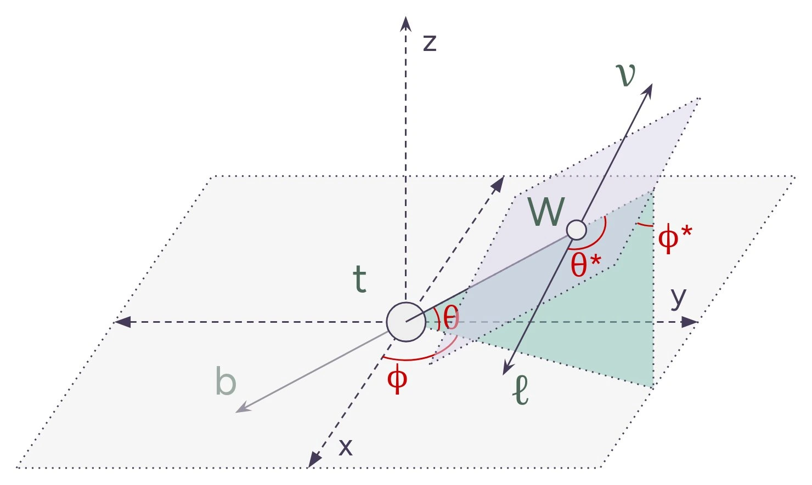
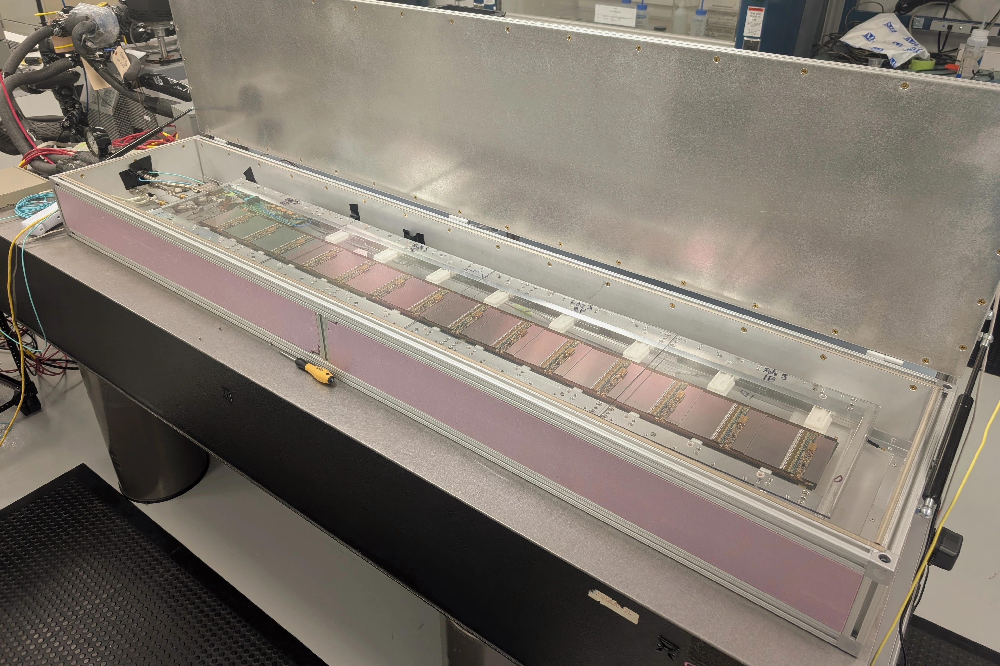



## Spin entanglement in single top quark decays

Entanglement between top quark pairs has been observed by the [CMS collaboration](http://dx.doi.org/10.1088/1361-6633/ad7e4d) and the [ATLAS collaboration](http://dx.doi.org/10.1038/s41586-024-07824-z). Single top decays $$t\to Wb\to\ell \nu b$$, in contrast to $$t\bar{t}$$, offer a highly polarized beginning and a foundation for new studies of spin properties. These decays can be described by four angles which, by conservation of momentum, provide the full angular distribution of all the decay products. Full details of this distribution were first described in a [paper](https://arxiv.org/abs/1702.03297) by J.A. Aguilar-Saavedra et al. in 2017. In my research, I'm working towards getting a measure of these angular distributions within the ATLAS detector, and leveraging tools like [SPANet](https://arxiv.org/abs/2106.03898) to accomplish this.  
*2024-present*

## Quality assurance for the ATLAS ITk Strips

In preparation for the High-Luminosity Large Hadron Collider, all of the experiments on the beam path of the LHC are being upgraded. For the ATLAS detector, one of these upgrades is a replacement of the current inner detector and transition radiation tracker with an entirely silicon inner tracker (ITk). The outer portion of this upgrade is a barrel made of long staves of silicon strip detectors, each consisting of 28 silicon modules. A lot of these staves are being made, and we'd like for them to survive the full runtime of the LHC. In preparation for full scale production, I developed and performed various quality assurance tests involving electrical testing, thermal cycling, and diagnosing of these staves at Brookhaven National Lab. This project represented the bulk of my ATLAS authorship qualification task.  
*2024-2025*

## Construction of magnetron sputterer

     
Electrical characterizations of lab-grown chips often require a conductive layer of material to be deposited on the chip. This, and other interesting ventures, can be performed by a magnetron sputterer. My peers and I designed and built a sputterer for our physics lab, with "home-grown" solutions including a 3D-printed support structure, a power supply constructed from old microwaves, and use of a Smucker's jelly jar as a vacuum chamber. The sputterer has successfully sputtered copper, nickel, goldpalladium, and indium metal. It was used to prepare specimens for scanning electron microscopy and to aid some of Berry College's researchers in the biology department.  
*2020-2021*
