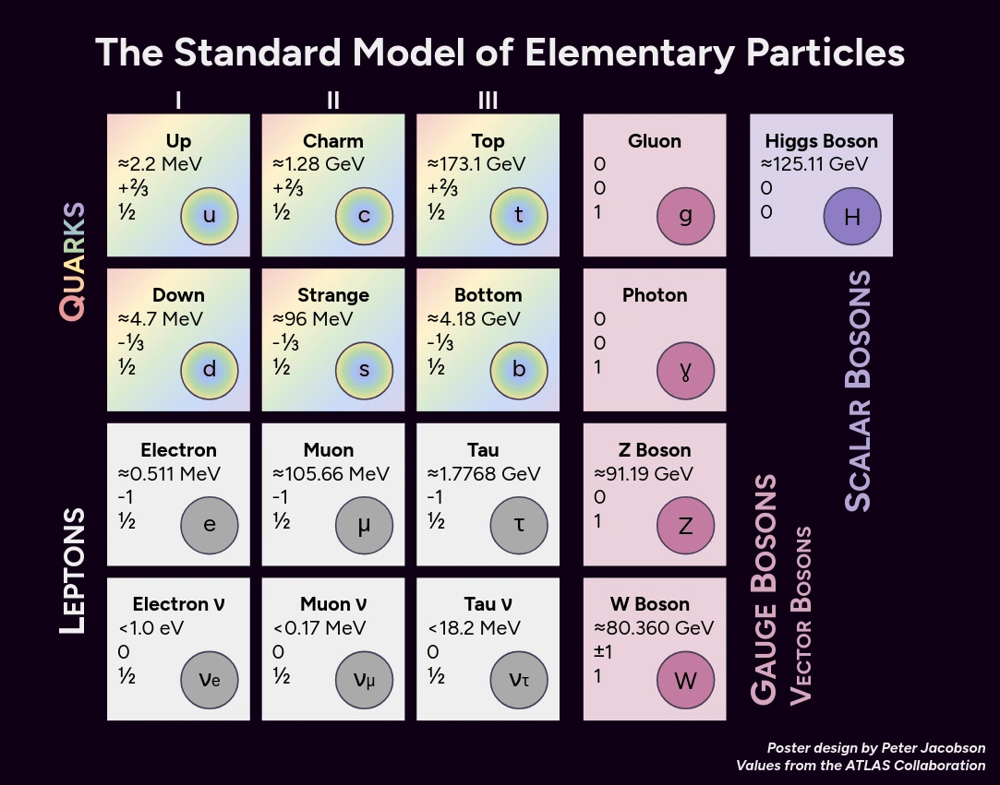



     
My colleagues and I discovered that, despite having an office specifically for particle physicists, we didn't have the standard model anywhere on our walls. I had a personal diagram I had made (using values from the [ATLAS collaboration](https://opendata.atlas.cern/docs/documentation/introduction/SM_and_beyond/)) for a presentation, so I made some tweaks to make it poster-friendly and sent it off to be printed.  
Some notes on design choices:
* The quarks are colored with a rainbow gradient to represent their color charge.
* In contrast, the leptons are gray to represent a lack of color charge.
* For vector bosons, I wanted a color that wasn't in the rainbow and wasn't gray. Pink, to bend definitions, "isn't a color" as it doesn't exist as a single wavelength of light. 
* For the Higgs, I wanted a color similar to the pink I'd chosen for the vector bosons.

This poster doesn't explicitly label fermions, assumes natural units by eschewing a $$/c^2$$, and skips labeling values as mass, charge, or spin. These choices were intentional, primarily for aesthetics.  
The poster was designed to be printed on 28"×22" paper, the file is availible [here](about:blank) if you'd like one for yourself.
